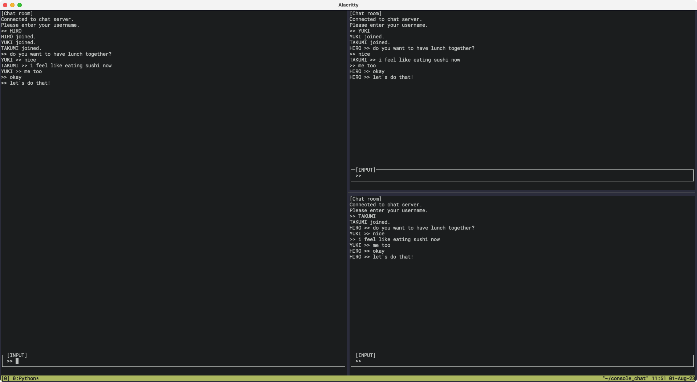

# console_chat
コンソール上で動くチャット(まだLAN内でしか動きません)

## 使い方
### サーバの起動
server.py をポート番号を引数にして実行してください。 
サーバのIPアドレスは自動的に0.0.0.0になっています。 
`python3 server.py <port>` 

### クライアントの起動
client.py をサーバのIPアドレスとポート番号を引数にして実行してください。 
`python3 client.py <ip> <port>` 
 
ncurses を使っているのですが、何故か表示が崩れてしまう場合があります。
表示が崩れた場合はEnterを何度押していただけると、直ると思います。 
 
クライアントを起動したら、最初にユーザ名を入力してください。 
退出するときは、`exit` と入力すると終了します。
